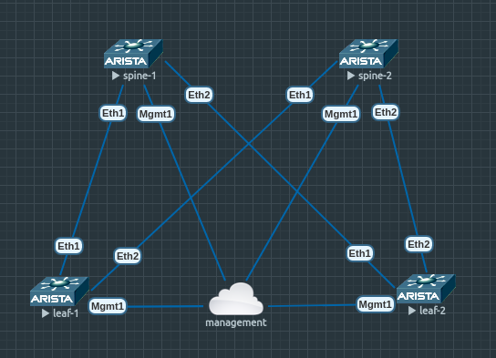

# Network Automation Lab
A small leaf-and-spine network which comprises four vEOS switches hosted on EVE-NG.




```bash
$ grep '.test' /etc/hosts
192.168.1.5	eve-ng.test
192.168.1.161	leaf-1.test
192.168.1.162	leaf-2.test
192.168.1.151	spine-1.test
192.168.1.152	spine-2.test
```

## Running 'show version' with ansible.builtin.raw
```bash
ansible-playbook hello-world.yml --ask-pass
```

## Activating eAPI for future use (https only)
```bash
$ ansible-playbook enable-eos-eapi.yml --ask-pass
SSH password: 

PLAY [eos] **************************************************************************************************************************************************

TASK [Enable eAPI] ******************************************************************************************************************************************
changed: [leaf-2.test]
changed: [leaf-1.test]
changed: [spine-1.test]
changed: [spine-2.test]

RUNNING HANDLER [save configuration] ************************************************************************************************************************
ok: [leaf-2.test]
ok: [spine-2.test]
ok: [leaf-1.test]
ok: [spine-1.test]

PLAY RECAP **************************************************************************************************************************************************
leaf-1.test                : ok=2    changed=1    unreachable=0    failed=0    skipped=0    rescued=0    ignored=0   
leaf-2.test                : ok=2    changed=1    unreachable=0    failed=0    skipped=0    rescued=0    ignored=0   
spine-1.test               : ok=2    changed=1    unreachable=0    failed=0    skipped=0    rescued=0    ignored=0   
spine-2.test               : ok=2    changed=1    unreachable=0    failed=0    skipped=0    rescued=0    ignored=0
```